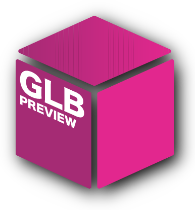
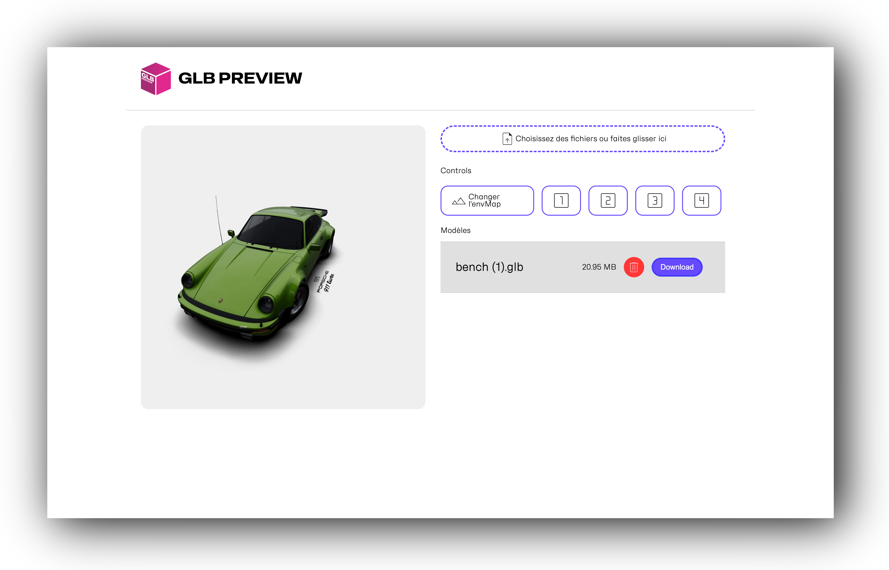

<p align="center">
    
</p>

# GLBPreview
> Outil de génération d'image à partir d'un fichier glb 
## Interface
<p align="center">
    
</p>

## Installation 

Pour commencer, clonner le projet

```bash
git clone https://github.com/OkeniteAnimation/GLBPreview.git
```
Ensuite vous pouvez lancer le projet avec la commande 

```bash
npm run dev 
```
Pour build le projet 

```bash
npm run build 
```

Vous pouvez publié votre GLBPREVIEW sur votre serveur ftp ou encore sur vercel ou heroku.

## Developpeur

- [@baptiste-bussiere](https://github.com/baptiste-bussiere)


